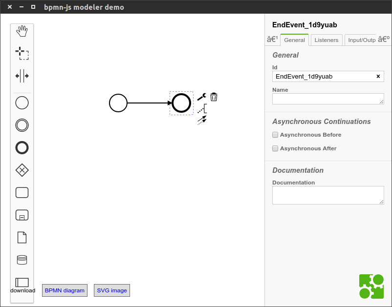

# BPMN.IO desktop app (using electron)

## installation

1. clone this repository `git clone git@github.com:HSKA-JSNinjas/bpmn-electron.git`
2. `npm install`
3. `grunt build`
4. `npm start`

## development

for development you can still use your normal browser. Just run a development server: `grunt auto-build`.

